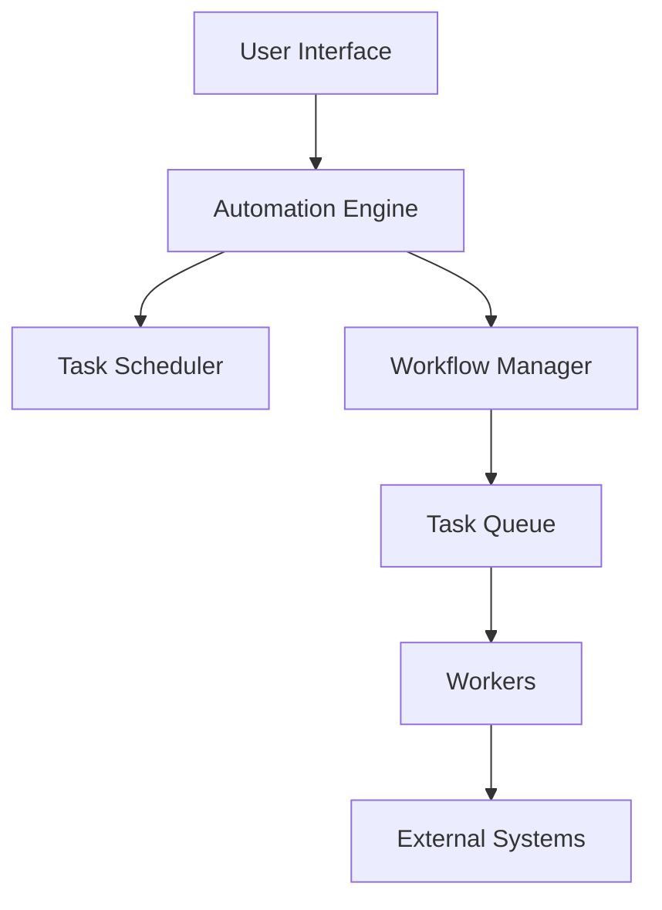

# Core Concepts

This guide introduces the fundamental concepts and terminology used in Automate-My-Job.com. Understanding these concepts will help you build effective automation workflows.

## Platform Architecture

Automate-My-Job.com is built on a modern, scalable architecture:



## Key Components

### 1. Workflows

A workflow is a sequence of automated tasks that accomplish a specific goal. Workflows can be:
- **Linear**: Tasks execute in sequence
- **Branching**: Tasks execute based on conditions
- **Parallel**: Multiple tasks execute simultaneously

### 2. Tasks

Tasks are the building blocks of workflows. Each task represents a specific action:
- File operations
- Web interactions
- Data processing
- API calls
- System commands

### 3. Triggers

Triggers initiate workflows based on events:
- **Schedule**: Time-based execution
- **Event**: Response to system events
- **Manual**: User-initiated
- **API**: External system calls

### 4. Variables

Variables store and manage data within workflows:
- **System Variables**: Pre-defined platform variables
- **User Variables**: Custom-defined values
- **Environment Variables**: System-specific settings

## Project Structure

A typical automation project includes:

```
my-project/
├── config/
│   ├── settings.json
│   └── credentials.json
├── workflows/
│   ├── main.workflow
│   └── subtasks/
├── data/
│   ├── input/
│   └── output/
└── logs/
```

## Security Model

Automate-My-Job.com implements a comprehensive security model:

### Access Levels
- **User**: Basic automation execution
- **Developer**: Workflow creation and editing
- **Admin**: Platform configuration
- **System**: Internal operations

### Data Protection
- Encryption at rest
- Secure credential storage
- Audit logging
- Access control lists

## Best Practices

1. **Modular Design**
   - Break complex workflows into smaller tasks
   - Reuse common components
   - Maintain clear task boundaries

2. **Error Handling**
   - Implement retry mechanisms
   - Define fallback actions
   - Log meaningful errors

3. **Performance**
   - Optimize resource usage
   - Schedule heavy tasks appropriately
   - Monitor execution times

4. **Maintenance**
   - Document workflows
   - Version control changes
   - Regular testing

## Integration Capabilities

Automate-My-Job.com can integrate with:

- Cloud services (AWS, Azure, GCP)
- Database systems
- Email servers
- Web services
- File systems
- Custom APIs

## Next Steps

- Learn how to [Create Your First Project](create-project.md)
- Explore [Automation Workflows](automation-workflows.md)
- Understand [Security & Permissions](security.md)

## Additional Resources

- [API Documentation](api-reference.md)
- [Best Practices Guide](best-practices.md)
- [Community Forums](https://community.automate-my-job.com) 